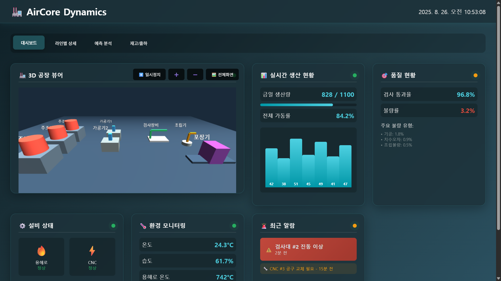

# 에어코어 다이나믹스 - 통합 제조 대시보드 (Air Core Dynamics - Integrated Manufacturing Dashboard)


실시간 제조 데이터를 시각화하고 관리하기 위한 웹 기반 대시보드입니다. Three.js를 활용한 동적인 3D 공장 뷰어를 통해 전체 공정 현황을 직관적으로 모니터링할 수 있는 환경을 제공합니다.

## ✨ 주요 기능 (Features)



- **📊 실시간 데이터 시각화**: 생산량, 가동률, 품질 현황, 환경 데이터 등 주요 지표를 실시간으로 추적하고 시각화합니다.
- **🏭 동적 3D 공장 뷰어**:
    - 전체 공장 설비의 배치와 가동 상태를 3D 모델로 시각화합니다.
    - 각 설비 모델을 클릭하여 상세 정보(ID, 공정, 표준 사이클 타임 등)를 확인할 수 있습니다.
    - 전체화면 모드를 통해 더욱 몰입감 있는 모니터링이 가능합니다.
- **📈 라인별 상세 분석**: 주조, 가공, 검사, 조립 등 각 공정 라인별 상세 데이터를 심층적으로 분석할 수 있습니다.
- **🔍 예측 분석**: 생산량 예측 및 주요 병목 구간 분석을 통해 선제적인 의사결정을 지원합니다.
- **📦 재고 및 출하 관리**: 완제품, 반제품 재고 현황과 당일/예정 출하량을 관리합니다.

## 📐 시스템 화면 흐름도 (Screen Flow Diagram)


본 다이어그램은 **Aircore Dynamics 통합 제조 대시보드**의 화면 이동 구조와 각 단계별 주요 표시 정보를 정리한 것입니다.  
개발자는 이를 참고하여 페이지 간 전환 로직과 데이터 연동 방식을 구현할 수 있습니다.

- **1단계 (메인 대시보드)**  
  - 전체 가동률, 일일 생산량, 현재 가동 장비 수, 공장 온습도, 전력량 등 공장 전체 현황 표시  
  - 사용자 액션: 공장 이미지를 더블 클릭하면 **공정별 화면(2단계)** 으로 이동  

- **2단계 (공정별 상세 화면)**  
  - 주조, 가공, 검사, 조립, 포장 등 각 공정별 가동률, 투입량, 가동 장비 수 표시  
  - 사용자 액션: 공정을 클릭하면 해당 공정 정보로 전환, 선택된 공정을 더블 클릭하면 **장비별 화면(3단계)** 으로 이동  

- **3단계 (장비 상세 화면)**  
  - 장비 번호, 상태(가동/정지/점검), 전력량(kW), 생산량(개/시간), 가동률(%) 표시  
  - 사용자 액션: 특정 장비를 클릭하면 해당 장비의 상세 정보로 변경  

## 🛠️ 기술 스택 (Tech Stack)

- **Frontend**: HTML5, CSS3, JavaScript (ES6+)
- **3D Graphics**: Three.js

## 🚀 시작하기 (Getting Started)

### 설치

이 프로젝트는 별도의 설치 과정이 필요 없습니다. Git 저장소를 클론(clone)하세요.

```bash
git clone [https://github.com/dotoriysa/Aircore-Dynamics.git](https://github.com/your-username/your-repository.git)
````

### 실행

클론한 디렉터리로 이동하여 메인 HTML 파일을 웹 브라우저에서 엽니다.

1.  프로젝트 폴더로 이동합니다.
2.  `Factory_Dashboard.html` 파일을 더블 클릭하거나 브라우저에서 '파일 열기'로 엽니다.

## 📂 파일 구조

```
.
├── Factory_Dashboard.html  # 메인 대시보드 페이지
├── view.html               # 전체화면 3D 뷰어 페이지
├── CONTRIBUTING.md         # 기여 가이드 문서
└── README.md               # 프로젝트 소개 문서
```

## 🤝 기여하기 (Contributing)

이 프로젝트에 기여하고 싶으신가요? 먼저 [기여 가이드 (CONTRIBUTING.md)](https://github.com/dotoriysa/Aircore-Dynamics/blob/main/CONTRIBUTING.md) 문서를 꼭 읽어주세요. 여러분의 모든 기여를 환영합니다\!


-----

*이 README는 Air Core Dynamics 대시보드 프로젝트를 위해 작성되었습니다.*
