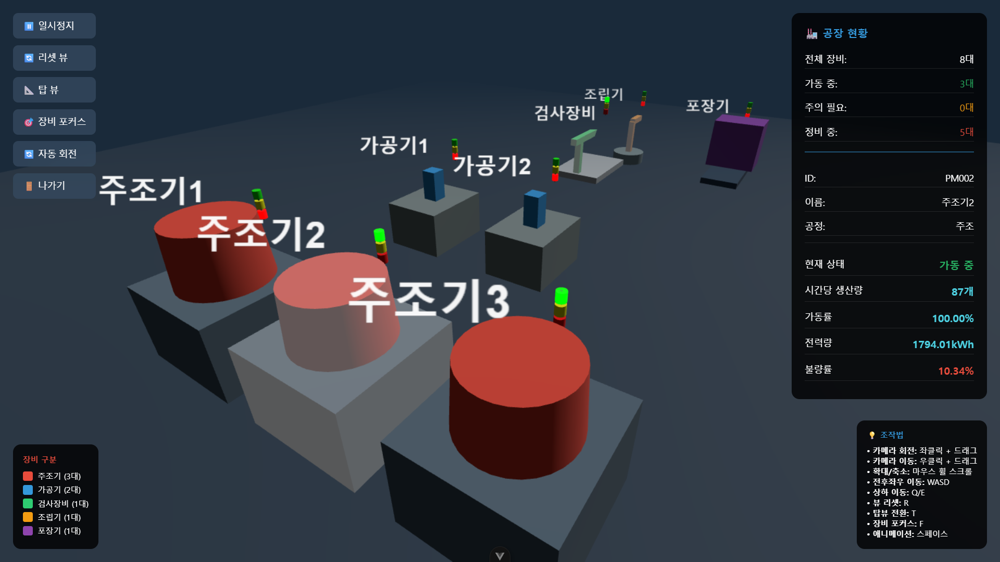
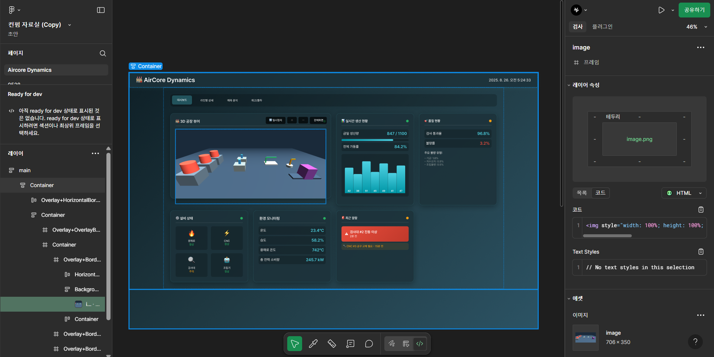
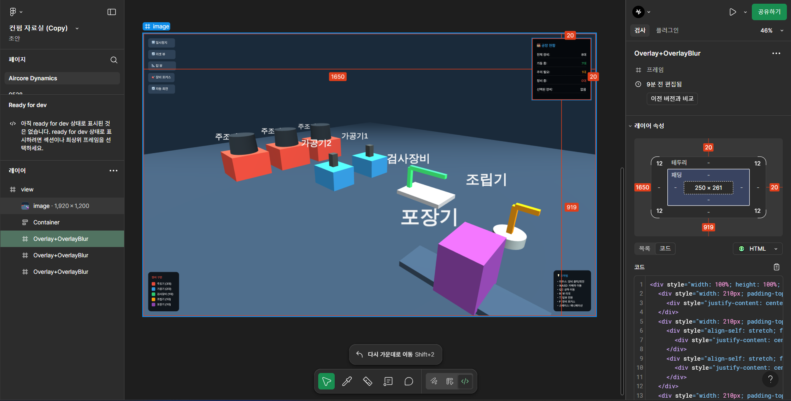

# Air Core Dynamics - 통합 제조 대시보드 (Integrated Manufacturing Dashboard)


## 📌 프로젝트 개요
**Air Core Dynamics**는 실시간 제조 데이터를 직관적으로 모니터링하기 위해 제작된 **웹 기반 스마트 팩토리 대시보드**입니다.  
Three.js 기반의 **3D 공장 뷰어**와 Figma를 활용한 **UI/UX 설계**를 통해,  
데이터 시각화 + 예측 분석 + 공정 모니터링을 하나의 통합 플랫폼에서 제공합니다.

---

## ✨ 주요 기능 (Features)


- **📊 실시간 데이터 시각화**: 생산량, 가동률, 품질 현황, 환경 데이터 등 주요 지표를 실시간으로 추적하고 시각화합니다.
    - **생산 현황**: 금일 생산량, 시간대별 생산 추세, 목표 대비 진행률
    - **가동 현황**: 전체 가동률, 공정별 가동률, 가동/정지 장비 수
    - **품질 관리**: 검사 통과율, 불량률, 불량 유형(기공, 치수오차, 조립불량 등) 분포 차트
    - **설비 상태 모니터링**: 용해로, CNC, 검사대, 조립기 등 주요 장비별 상태(정상/주의/정지) 표시
    - **환경 모니터링**: 온도, 습도, 전력 소비량 등 실시간 공장 환경 데이터
    - **알림 패널**: 장비 이상, 품질 문제, 에너지 급등 등 이벤트 발생 시 알림 표시
    - **3D 공장 뷰어 연동**: 공장 전체 뷰와 동기화되어, 데이터와 실제 설비 상태를 직관적으로 연결


- **🏭 동적 3D 공장 뷰어**:
    - 전체 공장 설비의 배치와 가동 상태(각 장비별 애니메이션 및 타워램프 불빛 색 RGB 변화)를 3D 모델로 시각화합니다.
    - 각 설비 모델을 클릭하여 상세 정보(ID, 공정, 표준 사이클 타임 등)를 확인할 수 있습니다.
    - 전체화면 모드를 통해 더욱 몰입감 있는 모니터링이 가능합니다.
    - **조작 버튼 제공**: 일시정지, 리셋 뷰, 탑 뷰 전환, 장비 포커스, 자동 회전, 나가기 등 직관적인 버튼을 통해 화면을 제어할 수 있습니다.
    - **키보드/마우스 조작 지원**:
        - **카메라 회전**: 좌클릭 + 드래그  
        - **카메라 이동**: 우클릭 + 드래그  
        - **확대/축소**: 마우스 휠 스크롤  
        - **전후좌우 이동**: WASD  
        - **상하 이동**: Q/E  
        - **뷰 리셋**: R  
        - **탑 뷰 전환**: T  
        - **장비 포커스**: F  
        - **애니메이션**: 스페이스바  


- **📈 라인별 상세 분석**:
    - 주조, 가공, 검사, 조립, 포장 등 각 공정 라인별 상세 데이터를 심층적으로 확인할 수 있습니다.
    - **라인 현황 지표 제공**:
        - 시간당 생산량, 가동률, 가동 장비 수
        - 전력 사용량, 불량률
        - 주요 설비별 상태 데이터 (예: 주조 온도, 압력, 속도 등)
    - **라인별 3D 뷰어 연동**:
        - 해당 라인의 장비 배치를 3D로 시각화
        - 각 설비 클릭 시 세부 상태 확인 가능
    - **상태 색상 표시 (라인 카드 헤더)**:
        - 🟢 **초록색 원**: 라인 내 모든 장비가 정상 가동 중
        - 🟡 **노란색 원**: 일부 장비만 가동 중
        - 🔴 **빨간색 원**: 라인 내 모든 장비가 정지 상태


- **🔍 예측 분석**: 생산량 예측 및 주요 병목 구간 분석을 통해 선제적인 의사결정을 지원합니다.


- **📦 재고 및 출하 관리**: 완제품, 반제품 재고 현황과 당일/예정 출하량을 관리합니다.


- **🧰 비가동 장비 관리**:
    - 비가동 중인 장비 목록을 표시합니다.
    - 특정 장비 클릭 시 오류코드 선택 UI를 제공하며, 선택 후 확인 버튼 클릭 시 `pmId`와 `errorCode`를 서버에 전송합니다.

---

## 🎥 실행 영상


> 실제 동작 화면 (실시간 데이터 시뮬레이션 + 3D 공장 뷰어)

---

## 📐 시스템 화면 흐름도 (Screen Flow Diagram)


본 다이어그램은 **Aircore Dynamics 통합 제조 대시보드**의 화면 이동 구조와 각 단계별 주요 표시 정보를 정리한 것입니다.  
개발자는 이를 참고하여 페이지 간 전환 로직과 데이터 연동 방식을 구현할 수 있습니다.

- **1단계 (메인 대시보드)**  
  - 전체 가동률, 일일 생산량, 현재 가동 장비 수, 공장 온습도, 전력량 등 공장 전체 현황 표시  
  - 사용자 액션: 공장 이미지를 더블 클릭하면 **공정별 화면(2단계)** 으로 이동  

- **2단계 (공정별 상세 화면)**  
  - 주조, 가공, 검사, 조립, 포장 등 각 공정별 가동률, 투입량, 가동 장비 수 표시  
  - 사용자 액션: 공정을 클릭하면 해당 공정 정보로 전환, 선택된 공정을 더블 클릭하면 **장비별 화면(3단계)** 으로 이동  

- **3단계 (장비 상세 화면)**  
  - 장비 번호, 상태(가동/정지/점검), 전력량(kW), 생산량(개/시간), 가동률(%) 표시  
  - 사용자 액션: 특정 장비를 클릭하면 해당 장비의 상세 정보로 변경

---

## 🖌️ UI/UX (Design - Figma)

본 프로젝트의 UI/UX는 **Figma**를 활용하여 설계되었습니다.  
디자인 단계에서는 다음과 같은 요소를 고려했습니다:

- **사용자 여정(User Flow)** 중심 와이어프레임 설계
- **정보 계층 구조**를 반영한 지표 시각화
- **다크 모드 기반**의 현대적인 공장 모니터링 UI

**대표 시안 예시**

| 메인 대시보드 | 공정 전체 화면 |
|---------------|-----------------|
|  |  |

---

## 🛠️ 기술 스택 (Tech Stack)

| 분야 | 기술 |
|------|------|
| **Frontend** |       |
| **3D Graphics** |  |
| **Backend** |    |
| **Database** |  |
| **Build Tool** |  |
| **Deployment** |  |
| **Design** |  |


- **Frontend**: Vue.js 기반 SPA(Single Page Application) 구조로 대시보드 구현  
  - **ECharts**: 생산 지표·설비 상태를 시각적으로 표현하는 대화형 차트/그래프 라이브러리  
  - **Three.js**: 실시간 3D 공장 뷰어를 구현하여 장비·라인 상태를 직관적으로 모니터링  
  - **HTML5, CSS3, JavaScript**: UI 구성, 반응형 스타일링 및 기본적인 클라이언트 로직 처리
- **Backend**: Spring Boot 3.4.9 기반 REST API 서버
- **ORM/Mapper**: MyBatis를 사용하여 공정/장비/생산 데이터 매핑
- **Database**: 개발·테스트 단계 및 운영 환경에서 MySQL 연동
- **Build & Deploy**: Maven 기반 빌드, Vercel을 통한 프론트엔드 배포

---

## 🚀 시작하기 (Getting Started)

### 설치

이 프로젝트는 별도의 설치 과정이 필요 없습니다. Git 저장소를 클론(clone)하세요.

1. 프로젝트를 클론합니다.

    ```bash
   git clone https://github.com/your-repo/Aircore-Dynamics.git
   cd Aircore-Dynamics
   ```
2. 프론트엔드 의존성을 설치합니다.

   ```bash
   cd frontend
   npm install
   ```

3. 개발 서버를 실행합니다.

   ```bash
   npm run dev
   ```

브라우저에서 http://localhost:5173 (Vite 기본 포트) 에 접속하면 대시보드를 확인할 수 있습니다.


---

## 📂 파일 구조

```plaintext
Aircore-Dynamics/
├── src/                  # Vue.js 프론트엔드 소스
│   ├── assets/           # 전역 리소스(폰트, 아이콘, 스타일)
│   ├── components/       # 재사용 UI 컴포넌트
│   ├── router/           # 라우팅 설정
│   └── views/            # 페이지 단위 화면
│
├── demo/                 # Spring Boot 백엔드 소스
│   ├── controller/       # API 컨트롤러
│   ├── service/          # 서비스 로직
│   ├── mapper/           # MyBatis 매퍼
│   └── model/            # 데이터 모델
│
├── docs/                 # 프로젝트 문서 및 ERD
└── README.md
```
🔎 전체 구조와 상세 설명은 [아키텍처 문서](./docs/architecture.md)에서 확인할 수 있습니다.

---

## 🤝 기여하기 (Contributing)

이 프로젝트에 기여하고 싶으신가요? 먼저 [기여 가이드 (CONTRIBUTING.md)](https://github.com/dotoriysa/Aircore-Dynamics/blob/main/CONTRIBUTING.md) 문서를 꼭 읽어주세요. 여러분의 모든 기여를 환영합니다\!


-----

*이 README는 Air Core Dynamics 대시보드 프로젝트를 위해 작성되었습니다.*
